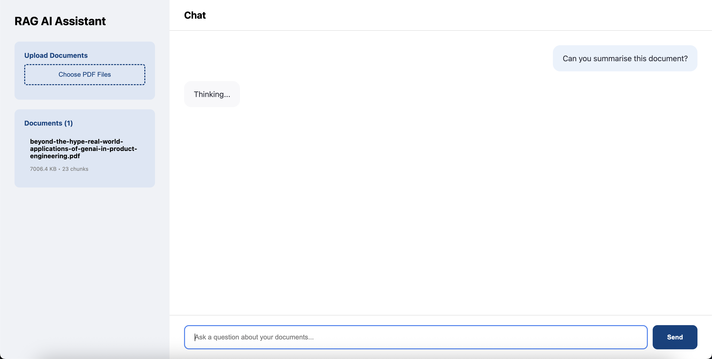
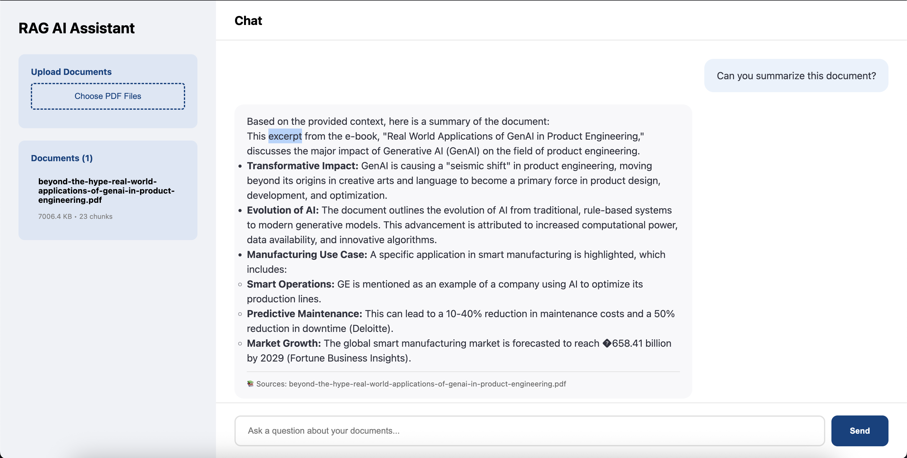

# Document-Based RAG AI Assistant

A **Document-Based Retrieval-Augmented Generation (RAG) AI Assistant** that allows users to upload PDF documents and interact with them through natural language queries. The system uses vector embeddings and LLM-powered generation to provide accurate, context-aware answers from uploaded documents.


## Features

- Upload multiple PDF documents  
- Automatic document chunking and embedding  
- Context-aware question answering  
- Semantic search using vector database  
- Real-time chat UI  
- Source-based answers  
- Clean and responsive frontend interface  


##  How It Works

1. **Upload PDFs** – Users upload documents through the UI  
2. **Chunking & Embeddings** – Documents are split into chunks and converted into vector embeddings  
3. **Vector Storage** – Embeddings are stored in a vector database  
4. **Query Processing** – User queries are converted into embeddings  
5. **Context Retrieval** – Relevant chunks are retrieved using similarity search  
6. **LLM Generation** – The LLM generates answers using retrieved context  
7. **Response Display** – Final answer is shown with document references  

## Application Screenshots

### 1. Welcome Screen


### 2. Document Upload & Processing


### 3. Document Summary Output



## Tech Stack

- **Frontend**: HTML, CSS, Flask
- **Backend**: FastAPI / Websocket
- **LLM**: gemini-2.5-pro
- **Embeddings**: gemini-embedding-001
- **Vector Database**: ChromaDB
- **File Parsing**: PyPDF


## Installation

```bash
git clone https://github.com/bablyraj/document-based-rag-ai.git
cd document-based-rag-ai
pip install -r requirements.txt
python frontend.py
python backend.py
